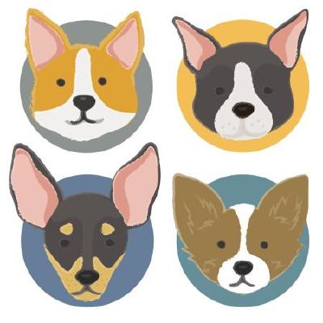

---
# Feel free to add content and custom Front Matter to this file.
# To modify the layout, see https://jekyllrb.com/docs/themes/#overriding-theme-defaults
title: Home
layout: home
---

# Welcome to ManyDogs!

## About ManyDogs

ManyDogs is an international consortium of researchers interested in Canine Science. Our primary goal is to foster global collaboration and open science practices (i.e., transparency and reproducibility) through multi-site projects. Read our [Mission Statement](https://docs.google.com/document/d/1iuYElQSssoOMVC3nu7BLrFZovoM0TIEqmGM1bUaYbpo/edit#bookmark=id.jesmtfmdggiu) for a detailed explanation of our purpose. 

By forming the ManyDogs consortium, we are establishing a collegial platform for addressing new questions and replicating historical findings on a greater scale than has been possible for any single research unit to date. Collectively, we will have the power to address questions such as breed or individual differences, or the impact of culture on behaviour, both of which have important implications for dog-human interaction and general dog welfare.

## ManyDogs 1

We are currently running our first project, ManyDogs 1 (MD1), on dog-human social communication. The aim of MD1 is to take a closer look at the long-debated question of whether dogs understand pointing as an informative gesture or as a command. We are currently investigating this by running a single study with standardized methodology in a large number of labs. Participating labs are currently based in North America and Europe, and we hope more researchers from around the world will join us. For more information on this study and how to get involved, please see the [ManyDogs1](manydogs1) section of this website. 
